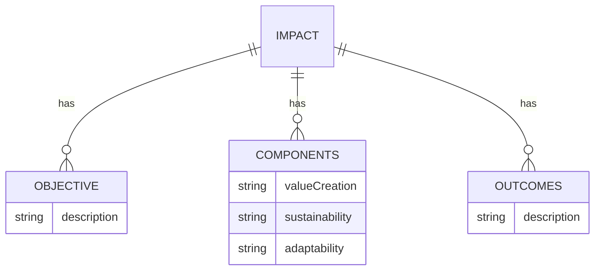

# Impact

## Objective
To drive sustainable growth and create positive change.

## Components
- **Value Creation:** Generate tangible value for stakeholders, ecosystems, and society.
- **Sustainability:** Integrate practices that support long-term benefits and resilience.
- **Adaptability:** Build flexible systems that respond to future challenges.

## Outcomes
Strengthened brand reputation, societal impact, and alignment with evolving market demands.

