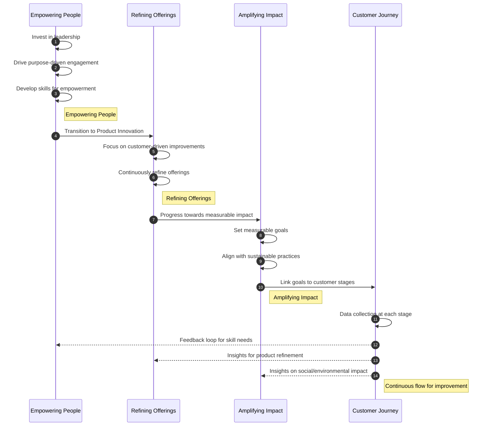

# Implementation Strategy

## Empowering People
Invest in leadership, purpose-driven engagement, and skill development.

## Refining Offerings
Foster customer-focused product innovation and continuous improvement.

## Amplifying Impact
Set measurable goals for social and environmental impact, aligning business growth with sustainable practices.

## Symbols and Their Meanings
- **Stars (★)** - **Automation Triggers**  
  _Example_: Trigger follow-up email after customer interaction.
- **Cylinders (⬤)** - **Data Collection Points**  
  _Example_: Capture user behavior data on the website.
- **Rectangles (▭)** - **Stages of Customer Journey**  
  _Example_: Awareness, Consideration, Conversion, etc.
- **Arrows (→)** - **Flow Direction**  
  _Example_: Progression from Awareness to Consideration.

