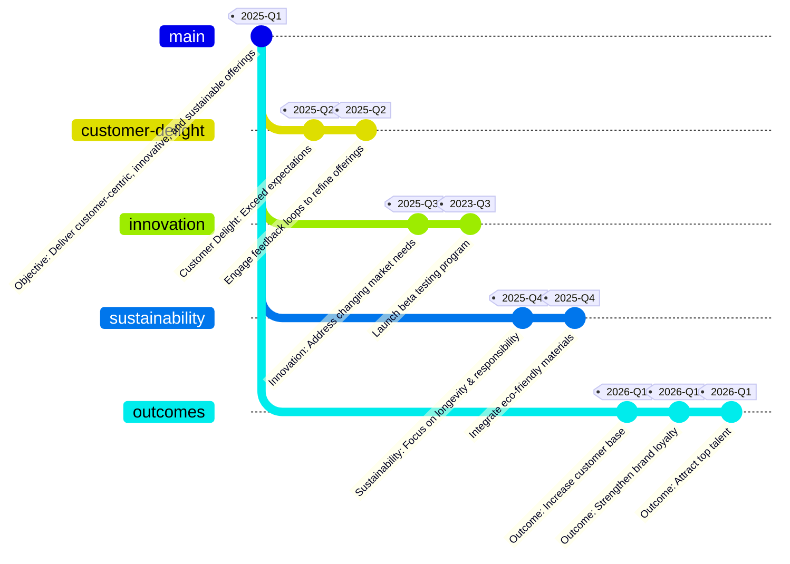

# Offerings

## Objective
To deliver innovative, customer-centric products and experiences.

## Components
- **Customer Delight:** Craft offerings that exceed expectations and inspire loyalty.
- **Innovation:** Continuously evolve to meet changing market needs.
- **Sustainability:** Design products and services with a focus on longevity and environmental responsibility.

## Outcomes
Increased customer base, strengthened brand loyalty, and attraction of top talent.