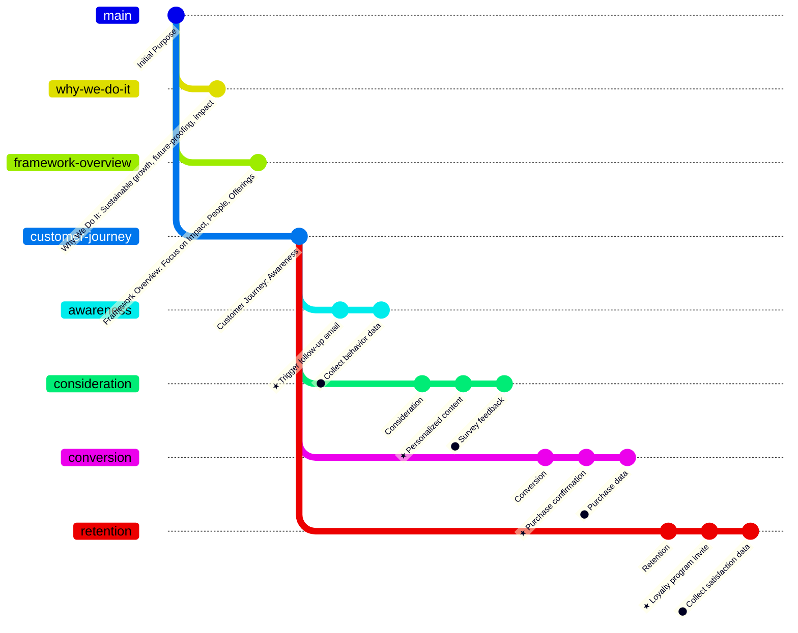

# Purpose and Rationale

## Why We Do It
To build sustainable growth, future-proof operations, and drive meaningful impact.

## Framework Overview
The Momentum Matrix focuses on three key pillars—Impact, People, and Offerings—to create continuous progress and lasting success.